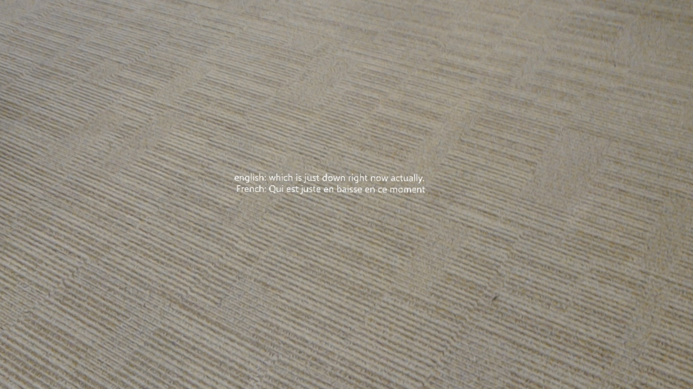

# hololens_bablefish
Translation app for the hololens. Uses the dictation api to translate spoken English (by the user, or someone they're facing) into text, which is then translated into the chosen language. Defaults to French. Say the phrase "translate to [language_name]" to change the output language. For example, "translate to german".

